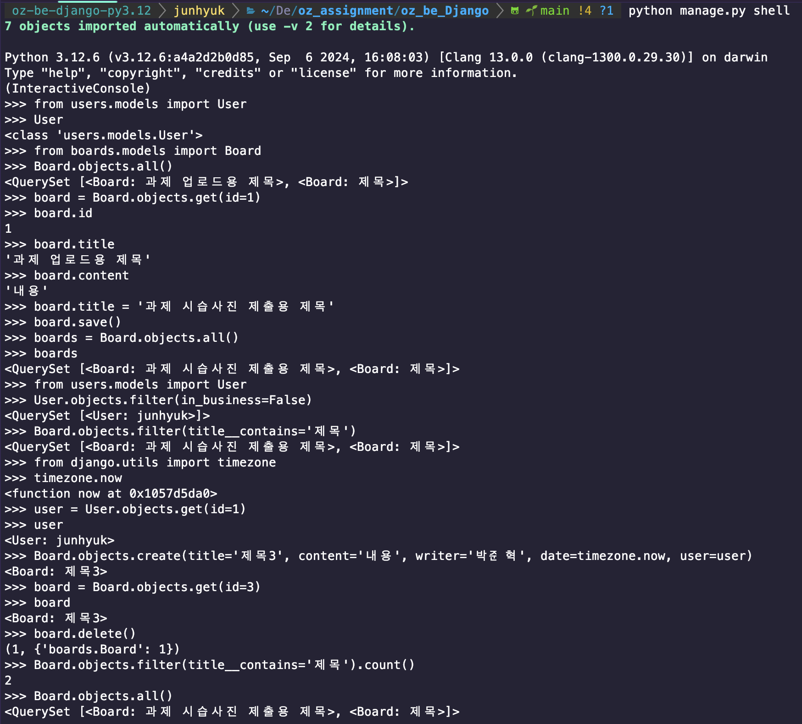

# **Django 수업 요약 정리**
---
## **1일차 - Django에 대해, 프로젝트 세팅**
#### **Django**
    - Django는 파이썬으로 작성된 오픈 소스 웹 프레임워크로, 웹 애플리케이션 개발을 빠르고 쉽게 할 수 있도록 도와줍니다.
    - Django는 MTV(Model-Template-View) 아키텍처를 기반으로 하며, 보안, 확장성, 재사용성을 강조합니다.
    - 기본적인 기능들이 이미 내장되어 있어 빠르게 개발을 시작할 수 있습니다.
    - 강력한 ORM 기능으로 데이터베이스 작업이 편리합니다.
#### **프로젝트 세팅 순서**
    1. 가상환경 생성을 위한 Poetry 설치
    2. 프로젝트를 진행할 폴더 생성 후 폴더 내에서 'poetry init' 으로 초기화 진행 후 가상환경에 Django 설치
        - poetry 설치 시 .venv 폴더가 프로젝트 내에 생성이 되지 않으면 순서대로 코드 입력 후 파이참 재시작
            poetry config virtualenvs.in-project true
            poetry config virtualenvs.path "./.venv"
    3. 가상환경에서 Django 프로젝트 생성
        - poetry run django-admin startproject 프로젝트명

        - 수업들으면서 많이 썼던 명령어 (python manage.py ~)
            - startapp appname : 앱을 생성합니다.
            - runserver : 서버를 실행합니다.
            - createsuperuser : 관리자를 생성합니다.
            DB 업데이트
            - makemigrations (appname) : app의 모델 변경 사항 체크합니다.
            - migrate : 변경 사항을 DB에 반영합니다.
---
## **2일차 - URL, view, Model 개념**

#### **URL Dispatcher(urls.py)**
    URL Dispatcher는 Django의 URL 라우팅 시스템으로 Django 웹 프레임워크의 핵심 구성 요소 중 하나이며,
    웹 요청을 처리하고 해당 요청에 맞는 View 함수로 라우팅하는 역할을 한다.
    * 'Dispatcher'란, 어떤 요청이나 정보를 받아 적절한 목적지 또는 처리 절차로 전달하는 역할을 하는 컴포넌트를 지칭하는 언어로 사용한다.

#### **views.py**
    일치하는 URL 패턴을 찾으면, URL Dispatcher는 해당 URL 패턴에 연결된 View 함수를 호출한다.
    view 함수는 HTTP 요청을 처리하고 응답을 반환합니다.

#### **urls.py의 구조**
    from django.contrib import admin
    from django.urls import path, include

    urlpatterns = [
        path('admin/', admin.site.urls), = 'admin/' URL로 사이트에 접근
        path('feeds/', include("feeds.urls")),
    ]

#### **Model의 개념**
    Model은 Django의 웹 애플리케이션의 데이터 구조를 정의하고, ORM(Object-Relational Mapping) 시스템을 사용하여 데이터베이스와 간편하게 상호작용을 할 수 있다.
    (DB로 치면 테이블과 같은 개념이다.)
    * ORM(Object-Relational Mapping)란, 모델을 통해 CRUD (Create, Read, Update, Delete) 작업을 SQL 쿼리를 작성하지 않고도 수행할 수 있도록 해주는 기술이다.

##### **models.py의 구조**

    class Board(CommonModel):
    title = models.CharField(max_length=50)
    content = models.TextField()
    writer = models.CharField(max_length=30)
    date = models.DateTimeField(auto_now_add=True)
    likes = models.PositiveIntegerField(default=0)
    reviews = models.PositiveIntegerField(default=0)
    user = models.ForeignKey('users.user',on_delete=models.CASCADE)

### **모델 사용**
    - 마이그레이션: 모델을 정의하거나 변경한 후에는 **`makemigrations`**와 **`migrate`** 명령어를 사용하여 데이터베이스 스키마를 생성하거나 업데이트해야 합니다.
    - 데이터 조작: Django 셸을 사용하거나 View 내에서 모델을 임포트하여 데이터를 생성, 조회, 수정, 삭제할 수 있습니다.

### **수업하면서 많이 사용한 모델 필드**
    - **CharField** : 짧은 문자열을 저장할 때 사용한다. max_length 파라미터가 필요함
    - **TextField**: 긴 문자열을 저장하는 데 사용한다. 문자열 길이 제한이 없슴
    - **DateField**: 날짜를 저장합니다. **`auto_now`**와 **`auto_now_add`** 옵션을 사용할 수 있다.
    - **DateTimeField**: 날짜와 시간을 저장한다.
    - **ForeignKey**: 다른 모델에 대한 링크를 나타내며, 일대다 관계를 가진다.
                  on_delete=models.CASCADE는 게시글(Post)이 삭제될 때 해당 게시글에 속한 댓글(Comment)도 함께 삭제시킨다.
    - **OneToOneField**: 다른 모델에 대한 일대일 관계를 나타낸다.
    - **ManyToManyField**: 다른 모델에 대한 다대다 관계를 나타냅니다.
    ** 선택 사항 및 추가 기능 **
    - null=True: 데이터베이스에서 해당 필드가 NULL 값을 가질 수 있음을 의미한다.
    - blank=True: 폼에서 해당 필드를 비워둘 수 있음을 의미한다.
    - default: 필드의 기본값을 설정한다.
    - unique=True: 필드의 모든 값이 고유해야 함을 나타낸다.
---
## **3일차 - Admin Pannel관리, custom_admin**
#### **Admin Pannel**
    Admin Pannel은 웹 애플리케이션의 데이터를 관리할 수 있는 강력한 도구이며,
    Admin Pannel을 사용하면 모델 데이터를 쉽게 추가, 수정, 삭제할 수 있다.
    Admin Pannel은 기본적으로 Django 프로젝트에 포함되어 있으며, 관리자 계정을 생성하고 모델을 등록하여 사용할 수 있다.

#### **Admin Pannel 활성화 방법**
    1. 관리자 인터페이스 활성화 - settings.py 파일에서 INSTALLED_APPS에 'django.contrib.admin'이 있는지 확인
    2. 모델을 관리자 페이지에 등록 - 추가 하고 싶은 모델을 만든 후 admin.py 파일에 등록
    3. 관리자 계정을 생성 - python manage.py createsuperuser
    4. 관리자 페이지 접 - python manage.py runserver
#### **관리자 페이지 커스텀 방법**
    class BoardAdmin(admin.ModelAdmin):
    list_display = ('title', 'writer','date', 'likes', 'reviews', 'content', 'updated_at', 'created_at') # 목록에 표시할 필드
    list_filter = ('likes', 'reviews') # 필터링 옵션
    search_fields = ('title', 'content') # 검색 필드
    ordering = ('date',) # 정렬 기준
    readonly_fields = ('writer',) # 읽기 전용 필드
    fieldsets = ( # 필드 그룹화
        (None, {'fields': ('title', 'content')}), # 기본 필드 그룹
        ('추가 옵션', {'fields': ('writer', 'likes', 'reviews'), 'classes': ('collapse',)}), # 추가 옵션 그룹
    )
    list_per_page = 10 # 페이지당 표시할 항목 수

#### **custom_admin**
    기본 Admin Pannel을 커스터마이징하여, 관리자가 데이터 관리 화면을 더 편리하게 사용할 수 있도록 변경하는 것을 의미한다.
    목록에 표시할 필드, 필터, 검색, 읽기 전용, 필드 그룹화 등 다양한 옵션을 admin.ModelAdmin 클래스를 상속받아 설정할 수 있다.
    이렇게 하면 관리자 페이지가 프로젝트의 요구에 맞게 맞춤화되어 효율적인 데이터 관리를 할 수 있다.
    * AbstractUser란, Django의 기본 User 모델의 기능을 상속받아 활용할 수 있게 해주는 클래스이다.
#### **custom_admin 만드는 순서**
    1. models.py에서 AbstractUser를 상속받아 사용자 모델을 정의한다.
    2. settings.py에서 AUTH_USER_MODEL을 커스텀 사용자 모델로 설정한다.
    3. users/migrations 폴더에서 숫자로 시작하는 파일 및 현재 생성되어 있는 데이터베이스를 삭제한다.
    4. makemigrations와 migrate 명령어를 실행한다.
    5.데이터베이스를 삭제하였으므로 createsuperuser 명령어로 관리자 계정을 다시 생성한다.
    6. users/models.py 를 수정하여 사용자 모델을 정의한다. -> 이 후 makemigrations를 다시 진행한다.
    7. common app을 생성하고, CommonModel 클래스를 정의한다(created_at, updated_at).
    8. 그 후 모델들의 상속 클래스들을 수정한다.
    9. DB에 반영 후 admin.py에서 커스터마이징한다.
---칟ㅁ
## **4일차 - ORM**
#### **ORM(Object-Relational Mapping)**
    객체 지향 프로그래밍 (클래스) <=== MAPPING ===> 관계형 데이터베이스 (테이블)
    - Object = 객체(Django)
    - Relational = 관계형 데이터베이스(MySQL, PostgreSQL 등) RDBMS
    - Mapping = 매핑(객체와 RDBMS의 연결을 도와주는 것)

#### *콘솔 들어가는 방법*
    - python manage.py shell

#### **QuerySet**
    QuerySet은 데이터베이스 쿼리를 표현 및 생성하는 도구이다.
    ** 수업들으면서 사용한 함수 **
    - filter(): 특정 조건에 맞는 객체를 필터링하여 출력해준다.
    - all(): 모든 객체를 출력한다.
    - get(): 특정 조건에 맞는 단일 객체를 출력한다.
    - count(): 객체의 개수를 출력한다.

#### **reverse accessors**
    관계를 역참조로 원하는 데이터를 조회할 수 있도록 도와주는 기능이다.(상속받은 쪽이 아닌 상속을 해주는 쪽에서 데이터를 찾을 수 있도록 해주는 기능)
---
## 실습 사진


---
## **5일차 - Django REST framework**
#### **REST(Representational State Transfer)**
    - Representaional = 표현
    - State = 상태
    - Transfer = 전송(클라이언트 <==> 서버 사이의 전송)

#### **API(Application Programming Interface)**
    - 프로그램간의 상호작용을 뜻한다. (데이터 교환)

#### **REST API**
    - 자원의 이름으로 표현(URI)하고, HTTP 메서드로 자원의 상태를 주고 받는 방식이다.
    - 구성요소
        1. 자원(Resource): URI로 표현(클라이어는 URI형식으로 서버에 데이터 요청)
        2. HTTP 메서드: 자원의 상태를 주고 받는 방법
            - GET: 자원 조회 (READ)
            - POST: 자원 생성 (CREATE)
            - PUT: 자원 전체 수정 (UPDATE)
            - DELETE: 자원 삭제 (DELETE)

#### **Serializer**
    - 클라이언트는 Django 객체를 이해할 수 없기 때문에 Django 객체를 JSON 형태로 변환해주는 역할을 한다.
    - 직렬화(Django(객체) => JSON), 역직렬화(JSON => Django(객체))
    - 코드 구조
        # users/serializers.py
        from rest_framework.serializers import ModelSerializer
        from .models import User
        
        class UserSerializer(ModelSerializer):
            class Meta:
                model = User
                fields = "__all__" # Model의 전체 field 가져옴
                fields = ("nickname", "email") # 원하는 특정 field만 가져옴
                exclude = ("password",) # 특정 field 제외 가능
---
## **6일차 - Django REST framework**
#### **partial=True**
    - 모델 인스턴스 업데이트 할 때 모든 필드에 대한 데이터가 필요한데 "partial=True"를 
    사용하면 일부 필드만 업데이트할 수 있도록 해주는 기능이다.

#### **many, read_only**
    - many=True: 다수의 객체를 직렬화할 때 사용한다. (예: 여러 사용자 정보를 반환할 때)
    - read_only=True: 해당 필드는 읽기 전용으로 설정하여 클라이언트가 해당 필드를 수정할 수 없도록 한다.

#### **IsAuthenticated**
    - IsAuthenticated는 Django REST framework의 인증 클래스 중 하나로, 사용자가 인증된 경우에만 API에 접근할 수 있도록 제한한다.
    - 인증되지 않은 사용자가 API에 접근하려고 하면 401 Unauthorized 응답을 반환한다.
    - settings.py 파일에서 REST_FRAMEWORK 설정에 추가하여 사용할 수 있다.

---
## **7일차 - Django REST framework**  
#### **authToken**
    - Django REST framework에서 제공하는 인증 시스템으로, 사용자가 로그인할 때 토큰을 발급받고,
    이후 API 요청 시 이 토큰을 사용하여 인증을 수행한다.
    - authToken은 Django의 기본 User 모델과 연결되어 있으며, 사용자가 로그인할 때 생성된다.

#### **TokenAuthentication**
    - TokenAuthentication은 Django REST framework에서 제공하는 인증 클래스 중 하나로, 사용자가 API 요청 시 토큰을 사용하여 인증을 수행한다.
    - settings.py 파일에서 REST_FRAMEWORK 설정에 추가하여 사용할 수 있다.

#### **IsAuthenticated**
    - IsAuthenticated는 Django REST framework의 인증 클래스 중 하나로, 사용자가 인증된 경우에만 API에 접근할 수 있도록 제한한다.
---
## **8일차 - Django Authentication**
    - **SQL 방식**
        - 기본적으로는 ORM(Objects-Relational Mapping)방식으로 데이터베이스 작업을 하지만, 복잡하거나 특정한 작업을 할 때에는 
          SQL 쿼리를 직접 작성할 수도 있다.
    - **파라미터화된 쿼리**
        - SQL 쿼리에서 데이터를 직접 입력하는 대신, 외부에서 값을 전달받아 사용하는 쿼리를 뜻한다.
    - **예시**
        1. **로그인 쿼리**
        
            ```python
            cursor.execute("SELECT * FROM users WHERE username = %s AND password = %s", (username, password))
            ```
        
        2. **댓글 삽입**
        
            ```python
            cursor.execute("INSERT INTO comments (comment) VALUES (%s)", [comment])
            ```
            
       3. **사용자 삭제**
        
           ```python
           cursor.execute("DELETE FROM users WHERE id = %s", [user_id])
           ```
        
       4. **제품 검색**
        
           ```python
           cursor.execute("SELECT * FROM products WHERE name LIKE %s", ['%' + product_name + '%'])
           ```
        
       5. **이메일 업데이트**
        
           ```python
           cursor.execute("UPDATE users SET email = %s WHERE username = %s", (new_email, username))
           ```

#### **Django Auth Login, Logout**
    - Django는 기본적으로 인증 시스템을 제공하며, 로그인과 로그아웃 기능을 쉽게 구현할 수 있다.
    - 로그인 시에는 사용자의 자격 증명을 확인하고, 세션을 생성하여 사용자를 인증한다.
    - 로그아웃 시에는 세션을 종료하고, 사용자를 인증 해제한다.

#### **Django JWT**
    - JWT(Json Web Token)는 JSON 포맷을 사용하여 사용자에 대한 속성을 저장하는 토큰입니다.
      주로 사용자 인증 및 권한 부여를 위해 사용되며,
      서버는 사용자 로그인 시 JWT를 생성하여 클라이언트에게 전달하고,
      클라이언트는 이후 요청마다 해당 토큰을 포함시켜 인증을 진행합니다.

#### **Simple JWT**
    Django REST framework에서 JWT 인증을 쉽게 구현할 수 있도록 도와주는 라이브러리입니다.
기본적으로 액세스 토큰과 리프레시 토큰을 관리하며, 인증 로직을 추상화하여 복잡한 구현 없이 JWT 기반 인증 기능을 사용할 수 있게 합니다.


### **Simple JWT와의 차이점**
    1. **수동 토큰 생성**:
        - 사용자가 제공한 자격 증명을 **`authenticate`** 함수로 검증합니다.
        - 유효한 자격 증명인 경우, **`jwt.encode`**를 사용하여 직접 JWT 토큰을 생성합니다.
        - 이 방식은 토큰의 구조와 내용을 완전히 제어할 수 있게 해줍니다.
        - 별도의 라이브러리(**`PyJWT`**)를 사용합니다.

    2. **`django-rest-framework-simplejwt` 사용 (Simple JWT)**:
        - **`TokenObtainPairView`** 및 관련 뷰를 사용하여 자격 증명을 검증하고 토큰을 발급합니다.
        - 토큰 생성 및 검증 로직이 라이브러리에 내장되어 있어 복잡한 구현을 요구하지 않습니다.
        - 액세스 토큰과 리프레시 토큰을 자동으로 관리합니다.
        - **`django-rest-framework-simplejwt`** 설정을 통해 토큰 동작을 조정할 수 있습니다.

---

## **9일차 - Django TestCode**
    - Django TestCode는 Django 애플리케이션의 기능을 검증하기 위해 작성하는 테스트 코드입니다.
    - Django는 기본적으로 테스트 프레임워크를 제공하며, 이를 사용하여 애플리케이션의 기능을 자동으로 검증할 수 있습니다.

#### **Django TestCode 작성 순서**
    1. **테스트 파일 생성**: 명령어 startapp을 하면 자동으로 생성되어 있는 tests.py 파일이 있다.
        - APITestCase:APITestCase 클래스는 Django의 TestCase 클래스를 확장하여 작성된 REST framework의 클래스입니다.
        DRF(Django REST Framework) 기반의 API 엔드포인트를 테스트하는 데 필요한 환경을 쉽게 구성할 수 있습니다.
        -reverse: Django의 URL 관리 시스템의 일부입니다. URL 패턴의 이름을 기반으로 해당 URL을 동적으로 생성해 줍니다.
                  이 함수는 URL을 하드코딩하지 않고 URL 패턴의 이름을 사용하여 URL을 찾아내므로 URL 구조가 변경되어도 코드를 수정할 필요가 없게 해줍니다.
    2. **테스트 클래스 작성**: Django의 TestCase 클래스를 상속받아 테스트 클래스를 작성합니다.
    3. **테스트 메서드 작성**: APITestCase을 상속받아 생성하여, 클래스는 REST framework의 기능을 확장하여 API 테스트에 필요한 추가적인 기능을 만든다.
        - setUp 메서드 : 각 테스트 메서드가 실행되기 전에 호출됩니다. 이곳에서 테스트에 필요한 사용자나 객체를 생성할 수 있습니다.
        - assertEqual / assertNotEqual : 두 값이 같은지 또는 다른지 확인합니다.
    4. **테스트 실행**: `python manage.py test` 명령어를 사용하여 테스트를 실행합니다.